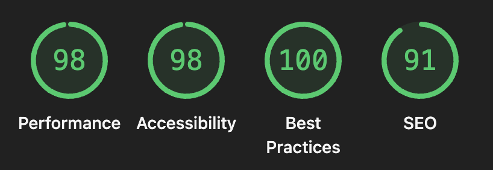

# DevFlash

[](https://dev-flash.netlify.app/decks)
[](https://angular.dev)
[](https://www.typescriptlang.org/)
[](LICENSE)
[](https://www.conventionalcommits.org)
[](https://prettier.io)

Offline-first flashcard PWA for developers preparing for technical interviews. Import CSV decks, study with session-based scheduling, and keep all data on your device — no account, no backend.

**[Try the live app ->](https://dev-flash.netlify.app/decks)**

---

## Why DevFlash?

Anki is powerful but heavy. DevFlash focuses on one workflow: review programming concepts efficiently on mobile or desktop, with only the features that matter for interview prep.

| Feature | What it gives you |
|--------|-------------------|
| **Session-based SRS** | Again / Hard / Good / Easy control when cards return (by study session, not calendar days) |
| **Code-aware cards** | Questions and answers support markdown and fenced code blocks |
| **CSV import** | Build decks in a spreadsheet, validate, preview, then import |
| **Local-first storage** | IndexedDB via Dexie — data never leaves the browser |
| **Mobile shell** | Bottom nav on small screens, side nav on desktop |

---

## Project highlights

Built as a portfolio-quality Angular 21 app with deliberate architecture boundaries:

- **Standalone components** — no NgModules; lazy-loaded feature routes
- **Signal-native UI** — `input()` / `output()` / `signal()` / `computed()` throughout features
- **Layered services** — `DbService` owns all persistence; `SchedulerService` is pure scheduling logic; features stay presentational
- **Strict TypeScript** — path aliases (`@models`, `@features/*`, …) and readonly domain models
- **Path-alias layout** — `core` / `features` / `layout` / `shared` separation for scalable growth

See **[Architecture](docs/ARCHITECTURE.md)** for diagrams, data flow, and design rules.

---

## Screenshots & quality



---

## Tech stack

| Layer | Choice |
|-------|--------|
| Framework | Angular 21 (standalone, signals) |
| Storage | Dexie.js -> IndexedDB |
| UI | Angular Material 3 + CSS custom properties (`--df-*`) |
| CSV | PapaParse + `ImportService` validation |
| Markdown / code | marked.js, highlight.js (integration in progress) |
| Package manager | pnpm |

---

## Code quality

DevFlash enforces consistent quality at every commit through an automated toolchain — no manual steps required.

### Formatting — Prettier + lint-staged

[Prettier](https://prettier.io) is configured with project-wide rules (`.prettierrc`). A Husky pre-commit hook runs [lint-staged](https://github.com/lint-staged/lint-staged) automatically, so only the files you actually changed are formatted before they land in git — keeping commits fast without skipping anything.

```bash
# Format the entire codebase manually
pnpm format
```

### Commit convention — Conventional Commits

Every commit is validated by [commitlint](https://commitlint.js.org) against the [Conventional Commits](https://www.conventionalcommits.org) spec. A malformed message is rejected before it reaches the repository.

```
<type>(<scope>): <short description>

feat(study): add progress bar to session
fix(db): handle missing deck on delete
refactor(srs): simplify interval calculation
chore: upgrade angular to 21.3
```

| Type | When to use |
|------|-------------|
| `feat` | New feature visible to the user |
| `fix` | Bug fix |
| `refactor` | Code change that is neither a fix nor a feature |
| `chore` | Tooling, dependencies, configuration |
| `style` | Formatting or whitespace only |
| `docs` | Documentation changes |
| `test` | Adding or correcting tests |
| `perf` | Performance improvement |

### Interactive commit prompt

Not sure which type fits? Run the guided prompt instead of `git commit`:

```bash
pnpm commit
```

[Commitizen](https://commitizen-tools.github.io/commitizen/) walks you through type -> scope -> description step by step and produces a valid message automatically.

### Pre-commit summary

| Hook | Trigger | What it does |
|------|---------|--------------|
| `pre-commit` | `git commit` | Runs Prettier on staged files via lint-staged |
| `commit-msg` | `git commit` | Validates message format with commitlint |

---

## Quick start

**Prerequisites:** Node.js 18+, [pnpm](https://pnpm.io/installation)

```bash
git clone https://github.com/bernarth/dev-flash.git
cd dev-flash
pnpm install
pnpm start
```

Open [http://localhost:4202](http://localhost:4202) (dev server port is configured in `package.json`).

---

## Documentation

| Doc | Audience |
|-----|----------|
| [Architecture](docs/ARCHITECTURE.md) | Developers — structure, routing, data model, SRS, services |
| [User guide](docs/USER_GUIDE.md) | End users — CSV format, studying, tags, settings |
| [Development](docs/DEVELOPMENT.md) | Contributors — conventions, scripts, path aliases |

---

## Color design

DevFlash uses a warm, low-strain palette designed for prolonged reading sessions.

### Principles

- **No pure black or white.** Pure #000000 on #FFFFFF creates the harshest contrast the eye can perceive, causing faster fatigue on long sessions. A warm off white background (#F9F7F3) and dark charcoal text (#222222) retain readability while softening the visual load.
- **Warm background.** A slight warm bias (F9F7F3 vs FAFAFA) reduces the blue-light emission of the screen's white point, which is the main source of eye strain under artificial light.
- **Muted, desaturated accents.** Saturated vibrant colors demand more from the eye's color receptors. Accent colors (primary, SRS buttons) are desaturated by 30% approx from their equivalent Material defaults.
- **WCAG AA contrast.** Every text/background pair targets a contrast ratio >= 4.5:1 (body text) or >= 3:1 (large UI labels) as required by WCAG 2.1 AA.

### Palette

| Token | Value | Usage |
|---|---|---|
| Background | `#F9F7F3` | Page background |
| Text | `#222222` | Body and heading text |
| Primary | Slate blue (M3 blue palette, light) | Buttons, active states, links |
| `--df-again` | `#C0444E` | "Again" rating button |
| `--df-hard` | `#C47C2B` | "Hard" rating button |
| `--df-good` | `#4A9E68` | "Good" rating button |
| `--df-easy` | `#2A9DB5` | "Easy" rating button |

### References

- [Creating accessible colors for human eyes](https://uxdesign.cc/creating-accessible-colors-for-human-eyes-66ed6a083230) — UX Collective
- [WCAG 2.1 — Contrast minimum (AA)](https://www.w3.org/WAI/WCAG21/Understanding/contrast-minimum.html)

---

## Contributing

Keep the scope focused: *does this make studying easier, or add friction?* See [Development](docs/DEVELOPMENT.md) before opening a PR.

---

## License

MIT — use it, fork it, share it.
