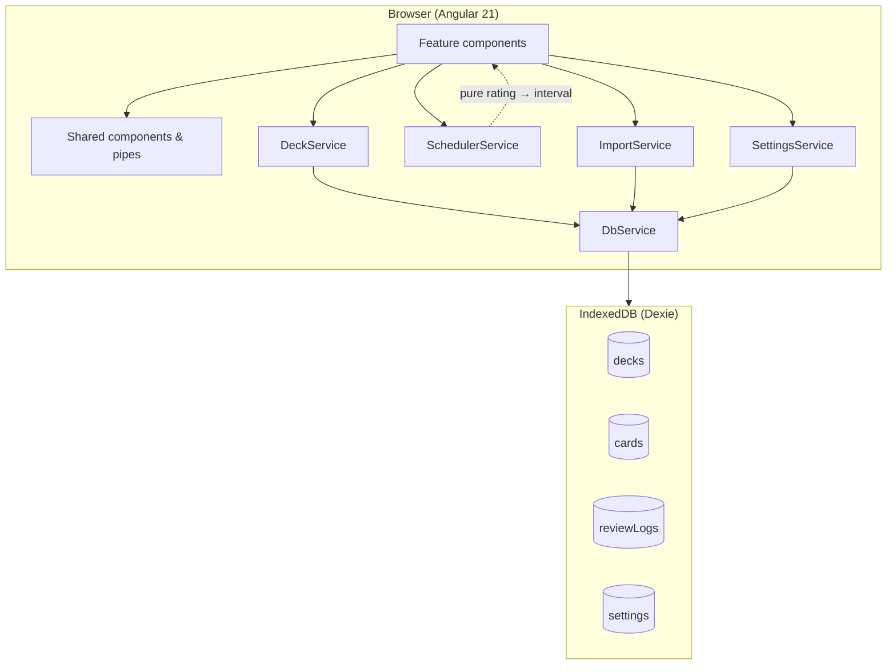
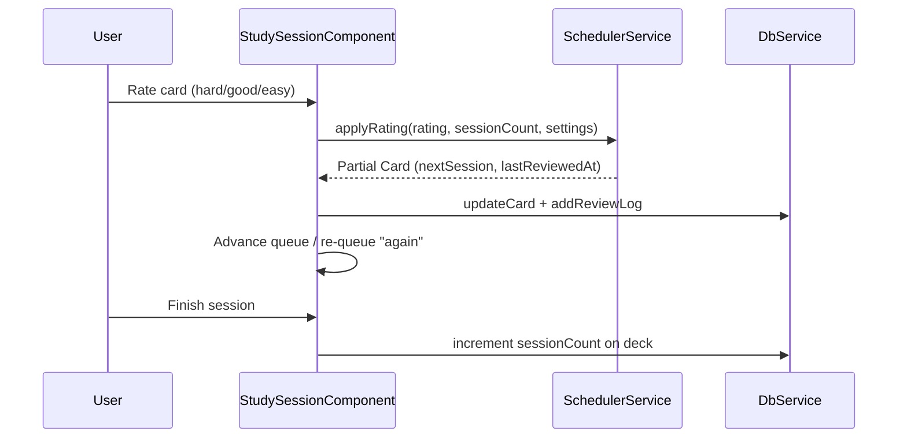

# DevFlash — Architecture

This document describes how DevFlash is structured today: an offline-first Angular SPA with no backend, session-based spaced repetition, and a clear split between persistence, scheduling logic, and UI.

---

## System overview



**Properties:**

- No API, auth, or sync — all state lives in the browser
- Features never import Dexie directly; only `DbService` touches the database
- `SchedulerService.applyRating()` has no side effects (easy to test and reason about)
- Optimistic UI: study session updates in-memory queue immediately; persistence uses `async/await` with explicit `void` for fire-and-forget writes where appropriate

---

## Application shell

Navigation is part of the root shell so it does not remount on route changes.

```
App (df-root)
├── SideNavComponent     (desktop, ≥768px)
├── <main>
│     └── <router-outlet>   ← lazy feature routes
└── BottomNavComponent   (mobile)
```

`App` composes layout chrome; feature routes render inside the outlet. Study routes use a full-screen layout inside the feature (toolbar + progress) rather than a separate layout wrapper component.

---

## Folder structure

```
src/app/
├── core/
│   ├── constants/          # e.g. rating button labels/colors
│   ├── models/             # Deck, Card, ReviewLog, AppSettings, Rating
│   ├── services/
│   │   ├── db.service.ts       # sole Dexie access
│   │   ├── deck.service.ts     # deck list aggregation
│   │   ├── scheduler.service.ts
│   │   ├── import.service.ts
│   │   └── settings.service.ts
│   └── utils/
├── layout/
│   ├── bottom-nav/
│   └── side-nav/
├── features/
│   ├── decks/              # deck-list, deck-create
│   ├── study/              # study-session, study-summary, study-list, learn-session
│   ├── cards/              # card-browser, card-editor
│   ├── import/             # import-wizard
│   └── settings/
├── shared/
│   ├── components/         # empty-state, confirm-dialog, …
│   └── pipes/              # relative-date
├── app.routes.ts
├── app.config.ts
└── app.component.ts
```

### Layer rules

| Layer | Responsibility |
|-------|------------------|
| **core/models** | Readonly interfaces; no mutation — create new objects |
| **core/services** | Domain and persistence; inject with `providedIn: 'root'` |
| **features** | Route-owned screens; orchestrate services, hold UI state as signals |
| **shared** | Presentational reuse; no business rules or DB access |
| **layout** | Persistent chrome only |

**Imports:** Features must not import other features. Shared must not import features.

---

## Routing

All feature components are lazy-loaded via `loadComponent()`.

| Path | Feature |
|------|---------|
| `/decks` | Deck list |
| `/decks/create` | Create deck |
| `/decks/:id/study` | Study session (primary) |
| `/decks/:id/review` | Study session (alias) |
| `/decks/:id/learn` | Learn session (legacy entry) |
| `/decks/:id/summary` | Post-session summary |
| `/decks/:id/browse` | Card browser |
| `/decks/:id/cards/:cardId` | Card editor |
| `/study` | Cross-deck study list |
| `/import` | CSV import wizard |
| `/settings` | Intervals, storage info, reset |

`withComponentInputBinding()` is enabled so route params can bind to component `input()`s where used.

---

## Data model

### Deck

```typescript
interface Deck {
  id?: number;
  name: string;
  description?: string;
  tags: string[];
  sessionCount: number;  // completed study sessions for this deck
  createdAt: Date;
  updatedAt: Date;
}
```

`sessionCount` advances when a study session finishes. It defines “which session we are in” for scheduling.

### Card

```typescript
interface Card {
  id?: number;
  deckId: number;
  question: string;   // markdown + optional fenced code
  answer: string;
  notes?: string;     // hidden during review by default
  tags: string[];
  nextSession: number;  // 0 = new / always due until first successful rating
  lastReviewedAt?: Date;
}
```

### ReviewLog

Append-only history of ratings for analytics and future features.

### AppSettings

Configurable session offsets: `hardInterval`, `goodInterval`, `easyInterval` (defaults 1, 3, 5).

---

## IndexedDB schema (Dexie v1)

| Store | Indexes | Notes |
|-------|---------|-------|
| `decks` | `++id`, `name`, `createdAt`, `updatedAt` | |
| `cards` | `++id`, `deckId`, `nextSession`, `*tags` | Multi-entry index on tags |
| `reviewLogs` | `++id`, `cardId`, `deckId`, `reviewedAt` | |
| `settings` | `++id` | Singleton row pattern |

`deleteDeck` runs in a transaction: review logs → cards → deck.

**Due cards query:** `nextSession <= deck.sessionCount` (includes new cards at `nextSession === 0`).

---

## Session-based scheduling

DevFlash uses **session offsets**, not SM-2 day intervals. The algorithm lives in `SchedulerService`:

| Rating | Behavior |
|--------|----------|
| **again** | Re-queued at end of current session; no card row update for interval |
| **hard** | `nextSession = currentSession + hardInterval` |
| **good** | `nextSession = currentSession + goodInterval` |
| **easy** | `nextSession = currentSession + easyInterval` |

When a session completes, `deck.sessionCount` increments by 1. Cards scheduled for future sessions drop out of the due queue until `sessionCount` catches up.



---

## Study session (in-memory queue)

`StudySessionComponent` keeps session state in signals:

- Loads due cards from `DbService.getDueCards(deckId, sessionCount)`
- Maintains `remaining` queue and `doneCount`
- **Again:** push card to end of `remaining` without persisting interval change
- **Hard / Good / Easy:** persist via `SchedulerService` + `updateCard`, append `ReviewLog`
- On completion: navigate to summary and bump `sessionCount`

This separates **fast UI feedback** from **async persistence** at the component boundary.

---

## Import pipeline

`ImportService` wraps PapaParse and enforces schema rules:

- `.csv` only; required `question` + `answer` columns
- Unknown columns → warning, ignored
- Empty question/answer rows → skipped with reason
- Tags sanitized, never fail the file

The wizard shows a preview and `ImportResult` (`imported`, `skipped`, `warnings`) before `DbService.bulkAddCards()` on confirm.

---

## Angular platform choices

| Choice | Rationale |
|--------|-----------|
| Zoneless CD | Signals + explicit updates; smaller runtime |
| `inject()` | Consistent with standalone components |
| `async/await` for Dexie | Native Promise API; RxJS only where streams add value (e.g. debounced search) |
| Lazy routes | Smaller initial bundle |
| Signal forms (planned) | Multi-field editors use `@angular/forms/signals` per project standards |
| CSS transitions only | No `@angular/animations` package |

Path aliases (see [Development](./DEVELOPMENT.md)) keep imports stable across refactors.

---

## Styling

Global design tokens in `src/styles/variables.scss`:

- `--df-font-size-*`, `--df-font-weight-*` for typography
- `--df-icon-size-*` for icon dimensions
- `--df-*` color tokens for light/dark (theme service planned)

Feature components should not set raw `font-size` / `font-weight`; use tokens.

---

## Planned evolution

Tracked in project checklist (`CLAUDE.md`):

- **PWA:** `@angular/pwa`, `ngsw-config`, precache shell + highlight.js themes
- **Layout route:** optional `LayoutComponent` parent route (nav hide on study — today handled in feature CSS)
- **Shared library:** `df-icon`, `card-flip`, `markdown-viewer`, `rating-buttons`, `session-progress-bar`
- **ThemeService / ExportService:** user theme override + JSON backup
- **Markdown pipeline:** sanitize marked output; highlight.js in `code-block`

These do not change the core boundaries above — they fill in presentation and ops around the same `DbService` + `SchedulerService` core.

---

## Related docs

- [User guide](./USER_GUIDE.md) — CSV format and study workflow
- [Development](./DEVELOPMENT.md) — scripts and contributor conventions
- [README](../README.md) — portfolio overview and quick start
